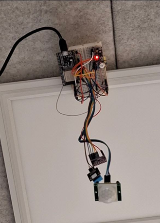

# General
Project focuses on the deployment of sensing and inference of human count using the ESP32 MCU within a small self-study glass cube (Tellus, University of Oulu). Built using the Platformio IDE extension for VSCode, some external libraries are used. Inference and model deployment on the ESP32 MCU is implemented using Tensorflow Lite Micro library, a restructured official version (needed for PIO/Arduino support) from the Platformio registry. 
<<<<<<< HEAD
# Project structure
 1. AIDA: Modelling directory
 2. CoAPServer: Python CoAP server
 3. ESP32Inference: Actual program code for the ESP32, the easiest way to compile and flash is to use it with PlatformIO (since it doesn't have CMakelists). PlatformIO will also pull the correct Tensorflow Lite Micro library (check platformio.ini).
=======
# Setup

* ESP32-WROOM-32 MCU
* GY-91 sensor board (BMP280 sensor: pressure + temperature)
* CCS-811 sensor board (co2 ppm + tvoc ppm)
* MLX90614 sensor board (IR thermometer ambient + object temperature)
* DHT-11 sensor (humidity + temperature)
* PIR sensor (system measure uptime of PIR)
* Button

GY-91, CCS811 and MLX are sharing same I2C bus, DHT uses single wire so RMT driver was used for high precision pulse width capture and decoding.

>>>>>>> d3e9d3c (More documentation)
# Current state
* Collects 9 sensor readings every 10s  
Data is sent to server via CoAP using Wi-Fi module and stored in DB
* Quantized ANN runs on MCU  
Inference in separate thread
* 3 operating modes  
Controlled via button ISR (quick double click = mode switch, hold = deep sleep).
* Custom sensor libraries  
For BMP280, DHT (with RMT driver for reliable pulse reading), and minor tweaks for MLX, CCS
1. System collects 9 sensor readings every 10 seconds (co2_ppm, tvoc_ppm, bmp280_temperature, bmp280_pressure, mlx_object_temperature, mlx_ambient_temperature, humidity_dht, temperature_dht, pir_uptime) and sends them to the server (using CoAP protocol over Wifi), the server stores them into SQL database.
2. The system implements LSTM model, and can run inference and output predictions, and send them to the server. When inference starts system collects 20 observations for the seeding data sequence (about 3.5 minutes of warm-up time). Inference is implemented as a separate RTOS task and doesn't block the main loop, so the system is always responsive. Process synchronization is achieved using RTOS Event Groups.
3. System supports 3 modes of operation: Deep Sleep, Inference, and Data Collection, which can be toggled with a button (two quick clicks switch between inference/data collection, one second hold puts the MCU into deep sleep). Button states are handled asynchronously using the pin ISR.
4. For GY-91 sensor board separate library is written, which allows configuring its sensors quite deeply, for DHT (humidity sensor) also was written a separate library which uses ESP32 remote transmission driver (rmt) for demodulation of the pulse (yes it works with a wire), the main benefit of using the driver is that in comparison with Adafruit Library obtaining the reading from DHT is reliable, and doesn't block interrupts. MLX and CCS libraries were pulled from GitHub with some minor adjustments, but they also allow to do deep configuration of corresponding sensors and their operation modes. Communication class is wrapper for CoAP.
# TODO
1.  Deep sleep mode is not fully finished. ESP itself sleeps, but sensors are still awake. The following sensors must be manually put into sleep: CCS, MLX, BMP (functions are present). MLX SCL line must be pulled low 40 ms on wakeup.
2.  Model is still very weak, more data needed, more architectural tweaking needed, haven't yet tried to train a model on transitions between human counts(this might help). For instance classification works very poorly for human count with a right-shifted ground truth values as secondary input along with sensor data sequence (teacher forcing using X[i] -> Y[i-1] mapped inputs to predict X[i] output based on past), so at the moment, LSTM + regression is used for human count, and LSTM + binary classification for ventilation state (air conditioning) model has 3 inputs which are then concatenated and 2 outputs. Tested training on sensor deltas from local reference state (first vector in sequence), and global reference (observed environmental state on the first measurement after booting). The data is very noisy (sensor quality issues? (didn't have enough time to do in-depth data analysis/preprocessing, EWM might help), patterns change between datasets (collected readings were split into separate datasets based on measurement day and system reboots), and a low amount of transitions between counts impacts the results as well, so in terms of that some kind of augmentation must be done.
3.  The idea of using sensor deltas comes from the purpose of the weather/ambient/environmental dependency compensation.
4.  Docker container for CoAP server, and also a web UI to view the data/prediction results.
